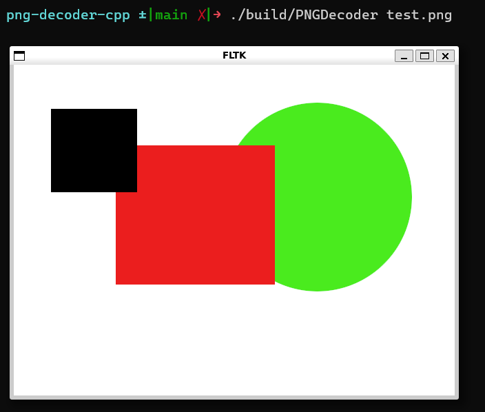

### PNG Decoder and Renderer
This is a very basic PNG decoder implemented for learning purpose. It can decode and render 8bit RGB PNGs.
It uses A nearest neighbor algorithm to adjust the image size to fit in the viewport.

### Build steps
- Clone the repo `git clone https://gitlab.com/shivendratechster/png-decoder-cpp.git`
- Build FLTK `cd libs/fltk-1.3.9 && cmake -B build && make -C build && cd -`
- Build the project `cmake -B build && make -C build`
- Display the test.png `./build/PNGDecoder test.png`

